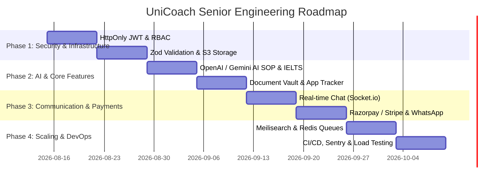

# 🚀 UniCoach — Senior Software Engineer Technical Audit & Production Roadmap

> **Author:** Senior Software Engineering Lead  
> **Date:** August 2026  
> **Project:** UniCoach (LeapsScholar Clone / Overseas Education & Student Counseling Platform)  
> **Repository:** `c:\unicoach`

---

## 1. 📊 Executive Summary & Current Project Stage

### Current Stage: **Beta / MVP+ (Pre-Launch Stage)**

UniCoach has successfully built its core functional MVP. The application features a full-stack architecture with a **React + Vite Frontend**, an **Express.js + Mongoose Backend**, an **Admin Panel**, and initial **Universities Datasets (USA, UK, Canada, Australia, Germany, Ireland)**.

| Component | Current Status | Maturity Level | Next Milestone |
| :--- | :--- | :--- | :--- |
| **Frontend App** | Student Dashboard, University Shortlisting, SOP Generator UI, Cost Calculator, IELTS Simulator | **75% Complete** | Real-time tracking, AI API integration, Mobile Responsiveness Polish |
| **Backend API** | REST endpoints for Auth, Leads, Admin, Content, Events, Forms, Bookings | **80% Complete** | Security hardening, Zod input validation, S3 Storage migration |
| **Admin CRM** | Lead management, Pipelines, Messaging templates, Booking calendar, Social media suite | **70% Complete** | Fine-grained RBAC permissions, Lead activity timeline |
| **Database & Data** | MongoDB schema with 1,500+ university records, indexing & cache layer drafted | **65% Complete** | Search Engine (Meilisearch/Atlas Search), Index optimization |
| **DevOps & Infra** | Dockerfiles, Nginx configs, Coolify deployment guide drafted | **60% Complete** | CI/CD Pipelines, Sentry error monitoring, BullMQ background queues |

---

## 2. 🔍 Senior Software Engineer Audit: What Remains & Gap Analysis

To transform UniCoach into an enterprise-grade, highly scalable, and secure platform capable of handling **500,000+ monthly active students**, the following engineering gaps must be addressed:

### A. 🛡️ Security & Access Control (Critical Priority)

| Feature / Area | Current State | Missing / Required Upgrade |
| :--- | :--- | :--- |
| **Authentication** | Basic JWT tokens stored in `localStorage` | **HttpOnly + Secure + SameSite Cookies** with **Refresh Token Rotation** to prevent XSS token theft. |
| **Authorization (RBAC)** | Simple `admin` vs `user` role check | **Fine-Grained Role-Based Access Control** (Counselor, Team Lead, Content Manager, Super Admin) with resource-level permissions. |
| **Input Validation** | Ad-hoc `req.body` checks inside routes | Centralized **Zod / Joi validation middleware** to enforce strict request schemas and block NoSQL/SQL injection attacks. |
| **File Storage Security** | Static `/uploads` folder on local disk | Migration to **AWS S3 / Cloudflare R2** with signed temporary URLs, file size constraints, and MIME type validation. |
| **API Rate Limiting** | basic `express-rate-limit` per IP | **Distributed Redis Rate Limiter** keyed on `User ID + IP` to prevent brute force and DDoS attacks across clustered servers. |

---

### B. ⚡ Performance, Search & Database Scalability (High Priority)

| Feature / Area | Current State | Missing / Required Upgrade |
| :--- | :--- | :--- |
| **University Search** | Standard MongoDB regex matching | **Dedicated Search Engine (Meilisearch / MongoDB Atlas Search)** for sub-50ms fuzzy matching on course names, tuition, GRE/IELTS requirements. |
| **Caching Layer** | In-memory cache middleware in `server.js` | **Production Redis Cache Cluster** with automatic invalidation on admin database updates. |
| **Background Processing** | Synchronous execution for emails/OTP | **BullMQ + Redis Task Queue** for asynchronous processing of OTPs, welcome emails, PDF SOP generation, and bulk messaging. |
| **Database Indexing** | Basic single-field indexes | **Compound Indexes** on `University` (`country`, `ranking`, `tuition`), `Lead` (`status`, `assignedTo`, `createdAt`), and `User` models. |

---

### C. 🎯 Feature Roadmap & User Impact (High Value Features)

#### 1. 🤖 True AI Integration (SOP & IELTS Practice)
- **Current:** Client-side template matching for SOP drafts.
- **Required:** Integrate **OpenAI GPT-4o / Gemini API** for:
  - **AI SOP Review & Polishing:** Analyzes student's draft SOP and provides contextual improvements for vocabulary, flow, and university specific alignment.
  - **AI IELTS Essay Scoring:** Evaluates IELTS Task 2 essays on standard band descriptors (Task Achievement, Coherence, Lexical Resource, Grammatical Accuracy) with instant band score predictions (0-9).

#### 2. 📁 Student Document Vault & Application Lifecycle Tracker
- **Current:** Basic saved universities list.
- **Required:**
  - **Document Vault:** Secure cloud folder for students to upload Transcripts, Passport, IELTS Scorecard, LORs, and Resume.
  - **Visual Application Pipeline:** Drag-and-drop or step-by-step progress tracking for each applied university (`Shortlisted` ➔ `Documents Verified` ➔ `Applied` ➔ `Offer Letter Received` ➔ `Visa Applied` ➔ `Visa Approved`).

#### 3. 💬 Counselor-Student Live Messaging & Call Scheduling
- **Current:** Static booking form.
- **Required:**
  - **Real-time Chat (Socket.io):** Direct in-app messaging between students and assigned admissions counselors.
  - **Integrated Video Booking:** Cal.com or Google Calendar OAuth integration for 1-on-1 counseling sessions.

#### 4. 💳 Monetization & Payment Gateway
- **Current:** Free application model.
- **Required:**
  - **Razorpay / Stripe Integration:** Enable payment for premium consultation packages, application fee assistance, and paid IELTS mock tests.

#### 5. 📢 Multi-Channel Automated Growth Engine
- **Current:** Basic Twilio SMS / Nodemailer setup.
- **Required:**
  - **WhatsApp Cloud API:** Automated instant WhatsApp notifications when a student submits a lead, gets shortlisting results, or receives an offer letter update.
  - **UTM & Lead Attribution:** Full tracking of traffic source (`utm_source`, `utm_medium`, `utm_campaign`) logged into the Lead CRM model.

---

### D. 🧪 Reliability, Testing & Monitoring (Operational Excellence)

| Tool / Practice | Purpose | Target |
| :--- | :--- | :--- |
| **Jest + Supertest** | API integration & unit tests | 80%+ test coverage on Auth, Leads, and Shortlisting backend routes. |
| **Playwright / Cypress** | End-to-end UI testing | Automated testing for User Sign-up, SOP creation, and Lead submission flows. |
| **Sentry / LogRocket** | Real-time error tracking | Automated alerts for unhandled exceptions on frontend and backend. |
| **Winston / Pino Logger** | Structured JSON logging | Centralized log ingestion for server performance, response latency, and DB errors. |
| **GitHub Actions CI/CD** | Automated deployment pipeline | Auto-lint, auto-test, build Docker container, and deploy to VPS on `main` branch push. |

---

## 3. 🗓️ Strategic 4-Phase Step-by-Step Execution Plan

### Phase 1: Security Hardening & Data Infrastructure (Weeks 1–2)
1. **HttpOnly Cookie Auth & Token Refresh:** Update `routes/auth.js` to store access token in memory and refresh token in `HttpOnly` cookie.
2. **Centralized Zod Validation:** Write request schemas for `/api/auth`, `/api/leads`, and `/api/shortlist`.
3. **AWS S3 / Cloudflare R2 Object Storage:** Replace local `/uploads` directory with `multer-s3` or `@aws-sdk/client-s3`.
4. **Database Compound Indexes:** Add compound indexes to `University.js`, `Lead.js`, and `User.js`.

### Phase 2: AI Capabilities & Student Workspace (Weeks 3–4)
1. **AI SOP & IELTS Essay Evaluator:** Build backend route `/api/ai/eval-essay` with Gemini/OpenAI integration for real-time writing feedback.
2. **Student Document Vault:** Add file upload and management interface in [UserDashboard.jsx](file:///c:/unicoach/frontend/src/components/UserDashboard.jsx).
3. **Visual Application Lifecycle Tracker:** Build student progress pipeline UI.

### Phase 3: Communication, Payments & CRM (Weeks 5–6)
1. **Socket.io Real-Time Messaging:** Connect student portal and admin CRM for direct chat.
2. **WhatsApp Cloud API Integration:** Send instant automated confirmation and status update messages.
3. **Payment Gateway Integration:** Set up Razorpay/Stripe checkout hooks for consultation fees.

### Phase 4: Enterprise Scaling, Search & DevOps (Weeks 7–8)
1. **Meilisearch / Atlas Search:** Implement ultra-fast university search engine.
2. **BullMQ Background Queues:** Offload emails, SMS, and reports to Redis background workers.
3. **GitHub Actions CI/CD Pipeline:** Automate tests and zero-downtime container deployments to Coolify / VPS.
4. **Sentry & APM Setup:** Install error logging and performance tracking monitoring.

---

## 📌 Summary of Deliverables Created
- Comprehensive Technical Audit File created: [`PROJECT_SENIOR_ENGINEERING_AUDIT_AND_ROADMAP.md`](file:///c:/unicoach/PROJECT_SENIOR_ENGINEERING_AUDIT_AND_ROADMAP.md)
