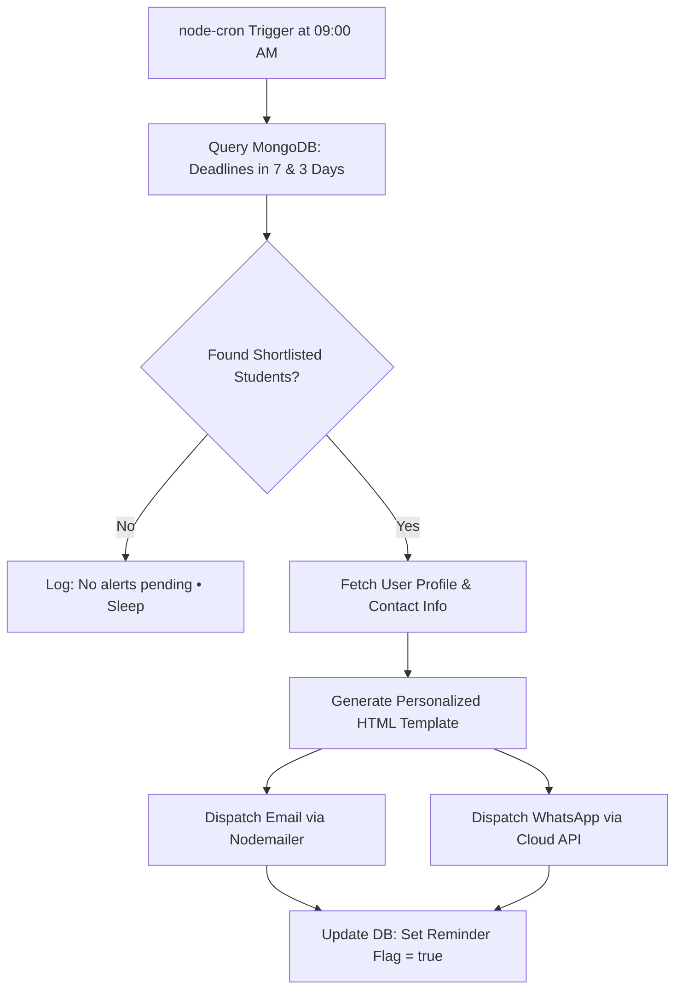

# 🎓 UniCoach — Scholarship Shortlisting & Deadline Tracker Engine
## 📋 Production-Grade Feature Specification & Architecture Design Document

> **Document Version:** 1.0.0 (Production Blueprint)  
> **Target Audience:** Engineering, Product, Design & QA Teams  
> **Component Scope:** Frontend (`/frontend`), Backend (`/backend`), Database (`MongoDB`), Scheduler (`node-cron` / BullMQ)  
> **Status:** Ready for Implementation  

---

## 1. 🌟 Executive Summary & Feature Vision

Studying abroad is one of the biggest financial investments a student makes. Financial aid and scholarships are the **#1 driving decision factor** for over 80% of study abroad aspirants. 

However, scholarship information today is:
* Fragmented across thousands of university portals.
* Confusing in eligibility criteria (GPA conversions, test cutoffs, department restrictions).
* Plagued by missed deadlines (scholarship application deadlines often close **2 to 4 months prior** to regular course admission deadlines).

### The Solution:
The **UniCoach Scholarship Shortlisting & Deadline Tracker Engine** is an enterprise-grade discovery, evaluation, and tracking system that empowers students to:
1. **Discover & Filter** 100% verified merit, need-based, and government scholarships across the USA, UK, Canada, Germany, Australia, and Europe.
2. **Calculate Match Fit / Eligibility Probability** against their personal GPA, IELTS/GRE scores, and target intake.
3. **Shortlist & Track Deadlines** with live, real-time visual countdown timers and 1-click Google Calendar synchronization.
4. **Receive Automated Drip Notifications** (Email/WhatsApp) 7 days and 3 days before critical cutoff dates.
5. **Convert into High-Value Leads** by booking 1-on-1 scholarship essay/SOP reviews with UniCoach counselors.

---

## 2. 🎯 What We Provide (Feature Breakdown & Capabilities)

### 2.1. 🔍 Public Scholarship Discovery & Explorer (`/scholarships`)
* **Multi-Facet Elastic Filtering:**
  * **Destination Country:** USA, UK, Canada, Germany, Australia, Ireland, France, etc.
  * **Degree Level:** Bachelors, Masters, MBA, PhD, Diploma.
  * **Funding Type:** Full Ride (100% Tuition + Living Stipend), Partial Tuition Waiver ($5,000–$25,000), Need-Based Aid, Government Grant.
  * **Field of Study:** STEM, Business & Management, Humanities, Healthcare, Arts & Design.
  * **Intake Season & Year:** Fall 2026, Spring 2027.
* **Instant Search:** Sub-50ms search on scholarship name, university name, or funding keywords.

### 2.2. 📊 Smart "Eligibility Fit Probability" Engine (100% Document-Free)
Compares student profile inputs against scholarship requirements to assign a match badge:
* **Academic Criteria:** GPA / Percentage, IELTS/TOEFL score, GRE/GMAT score, Target Course & Degree.
* **Financial Need Parameters (Zero Uploads / Lightweight Inputs Only):**
  * **Annual Family Income Range:** Dropdown (`< ₹8 Lakhs`, `₹8L–₹15L`, `₹15L–₹25L`, `> ₹25L`).
  * **Income Certificate Available?** Simple `Yes / No` toggle (No file uploading or document collection required).
* **Match Probability Buckets:**
  * 🟢 **High Match (Safe):** Student exceeds academic & financial criteria.
  * 🟡 **Target Match:** Student strictly satisfies all base criteria.
  * 🔴 **Reach / Highly Competitive:** Global prestigious award with intensive competition (e.g., Chevening, Fulbright).

### 2.3. ⏰ Dynamic Deadline Countdown & Visual Status Badges
Calculated live using client/server time difference against the official ISO deadline date:
* 🟢 `> 30 Days Remaining:` **Green Badge** — *“65 Days Left • Time to prepare documents”*
* 🟡 `15 to 30 Days Remaining:` **Yellow Badge** — *“22 Days Left • Finalize your SOP/Essay”*
* 🔴 `< 15 Days Remaining:` **Red Pulsating Badge** — *“Urgent: 6 Days Left • Submit Application”*
* ⚫ `0 Days / Past Date:` **Muted Gray Badge** — *“Closed for Fall 2026 • Reopens for Spring”*

### 2.4. 📅 1-Click Calendar Sync (Zero-API Cost)
* Generates an instant **Google Calendar / Apple iCal deep link** containing:
  * Event Title: `[UniCoach Alert] <Scholarship Name> Application Deadline`
  * Description: Application instructions, required documents, and official portal URL.
  * Notification: Native phone pop-up reminder set 3 days in advance.

### 2.5. 📂 Student Dashboard: "My Shortlisted Scholarships" Tab
* Dedicated kanban/list view inside the student portal.
* Pipeline stages: `Interested` ➔ `Essay Drafting` ➔ `Documents Ready` ➔ `Applied` ➔ `Awarded / Won`.
* "Book Scholarship Essay Review" CTA that routes directly to an admissions mentor.

---

## 3. 🗄️ Database Architecture & Data Modeling (MongoDB)

### 3.1. `Scholarship` Schema (`backend/models/Scholarship.js`)
```javascript
const mongoose = require('mongoose');

const scholarshipSchema = new mongoose.Schema({
  title: {
    type: String,
    required: [true, 'Scholarship title is required'],
    trim: true,
    index: true
  },
  slug: {
    type: String,
    unique: true,
    lowercase: true,
    trim: true
  },
  university: {
    type: mongoose.Schema.Types.ObjectId,
    ref: 'University',
    required: false // Optional if it is a government/national scholarship (e.g., Chevening)
  },
  universityName: {
    type: String,
    required: true,
    index: true
  },
  country: {
    type: String,
    required: true,
    enum: ['USA', 'UK', 'Canada', 'Germany', 'Australia', 'Ireland', 'France', 'Italy', 'New Zealand', 'Global'],
    index: true
  },
  fundingType: {
    type: String,
    enum: ['Full Ride', 'Tuition Waiver', 'Living Stipend', 'Need-Based', 'Research Grant'],
    required: true,
    index: true
  },
  amount: {
    value: { type: Number, required: true }, // e.g. 15000 or 100 (if percentage)
    currency: { type: String, default: 'USD' }, // USD, GBP, EUR, CAD, AUD
    isPercentage: { type: Boolean, default: false } // true if 100% or 50% waiver
  },
  description: {
    type: String,
    required: true
  },
  eligibility: {
    minGpa: { type: Number, default: 0 }, // e.g., 3.0 out of 4.0 or 70%
    minIelts: { type: Number, default: 0 }, // e.g., 6.5
    minToefl: { type: Number, default: 0 }, // e.g., 85
    minGre: { type: Number, default: 0 }, // e.g., 310
    degreeLevels: [{
      type: String,
      enum: ['Bachelors', 'Masters', 'MBA', 'PhD', 'Diploma']
    }],
    coursesApplicable: [String], // ['Computer Science', 'Data Science', 'All']
    genderPreference: {
      type: String,
      enum: ['All', 'Female Only', 'Minority'],
      default: 'All'
    },
    nationalitiesEligible: [String], // ['India', 'South Asia', 'International']
    maxFamilyIncome: { type: Number, default: null }, // e.g. 800000 INR (For need-based aid cutoff)
    requiresIncomeProof: { type: Boolean, default: false } // Only an eligibility toggle, NO document collection
  },
  applicationRequirements: {
    essayRequired: { type: Boolean, default: false },
    essayPrompt: String,
    lorsRequired: { type: Number, default: 0 },
    separateApplicationRequired: { type: Boolean, default: true },
    applicationPortalUrl: { type: String, required: true }
  },
  deadline: {
    date: { type: Date, required: true, index: true },
    intakeSeason: { type: String, enum: ['Fall', 'Spring', 'Summer', 'Rolling'], default: 'Fall' },
    intakeYear: { type: Number, default: 2026 }
  },
  isActive: {
    type: Boolean,
    default: true,
    index: true
  },
  viewsCount: { type: Number, default: 0 },
  shortlistCount: { type: Number, default: 0 }
}, {
  timestamps: true
});

// Compound Indexes for lightning-fast multi-filter queries
scholarshipSchema.index({ country: 1, 'eligibility.degreeLevels': 1, 'deadline.date': 1 });
scholarshipSchema.index({ 'deadline.date': 1, isActive: 1 });

module.exports = mongoose.model('Scholarship', scholarshipSchema);
```

---

### 3.2. `UserScholarship` (Shortlist & Tracking Schema)
```javascript
const mongoose = require('mongoose');

const userScholarshipSchema = new mongoose.Schema({
  user: {
    type: mongoose.Schema.Types.ObjectId,
    ref: 'User',
    required: true,
    index: true
  },
  scholarship: {
    type: mongoose.Schema.Types.ObjectId,
    ref: 'Scholarship',
    required: true
  },
  applicationStage: {
    type: String,
    enum: ['Shortlisted', 'Essay Drafting', 'Documents Ready', 'Applied', 'Awarded', 'Rejected'],
    default: 'Shortlisted'
  },
  studentNotes: {
    type: String,
    default: ''
  },
  notifications: {
    sevenDayReminderSent: { type: Boolean, default: false },
    threeDayReminderSent: { type: Boolean, default: false }
  }
}, {
  timestamps: true
});

// Prevent duplicate shortlists
userScholarshipSchema.index({ user: 1, scholarship: 1 }, { unique: true });

module.exports = mongoose.model('UserScholarship', userScholarshipSchema);
```

---

## 4. 🌐 REST API Specifications (`/api/scholarships`)

| Method | Endpoint | Access | Description |
| :--- | :--- | :--- | :--- |
| `GET` | `/api/scholarships` | **Public** | Search & paginate scholarships with filters (country, degree, funding, gpa, deadline). |
| `GET` | `/api/scholarships/:id` | **Public** | Detailed view, requirements, and similar scholarships. |
| `POST` | `/api/scholarships/match-probability` | **Public / Auth** | Calculates match probability percentage against student input parameters. |
| `POST` | `/api/scholarships/shortlist/:id` | **Private (User)** | Adds scholarship to user's personalized tracking list. |
| `DELETE` | `/api/scholarships/shortlist/:id` | **Private (User)** | Removes scholarship from user's tracking list. |
| `GET` | `/api/scholarships/user/my-list` | **Private (User)** | Returns user's shortlisted scholarships with computed live days remaining. |
| `PATCH` | `/api/scholarships/user/stage/:id` | **Private (User)** | Updates status stage (`Shortlisted` ➔ `Applied`). |
| `POST` | `/api/admin/scholarships` | **Private (Admin)**| Admin CRUD endpoint for publishing new verified scholarships. |

---

## 5. 🤖 Automated Notification & Cron Architecture

### 5.1. Daily Scheduler (`backend/services/scholarshipScheduler.js`)
* **Execution Interval:** Runs every day at **09:00 AM (Server Time)** via `node-cron`.
* **Logic:**
  1. Computes the target dates: `Today + 7 Days` and `Today + 3 Days`.
  2. Finds active user shortlists where the linked scholarship deadline matches the target date and notification has not yet been sent.
  3. Dispatches automated branded HTML email via **Nodemailer** + optional WhatsApp message via **Twilio**.
  4. Marks `sevenDayReminderSent = true` or `threeDayReminderSent = true` to prevent duplicate alerts.



---

## 6. 📅 1-Click Google Calendar Generator Logic

To provide seamless calendar integration without requiring costly Google OAuth API credentials:

```javascript
export function generateGoogleCalendarUrl(scholarship) {
  const title = encodeURIComponent(`[UniCoach Alert] ${scholarship.title} Deadline`);
  const details = encodeURIComponent(
    `Official Application Deadline for ${scholarship.title} at ${scholarship.universityName}.\n\n` +
    `Award: ${scholarship.amount.isPercentage ? scholarship.amount.value + '%' : '$' + scholarship.amount.value}\n` +
    `Portal Link: ${scholarship.applicationRequirements.applicationPortalUrl}\n\n` +
    `Managed via UniCoach Study Abroad Portal.`
  );
  
  // Format deadline date into YYYYMMDDTHHMMSSZ format
  const deadlineDate = new Date(scholarship.deadline.date);
  const formattedDate = deadlineDate.toISOString().replace(/-|:|\.\d\d\d/g, "");
  
  return `https://calendar.google.com/calendar/render?action=TEMPLATE&text=${title}&dates=${formattedDate}/${formattedDate}&details=${details}&add=3d`;
}
```

---

## 7. 🛡️ Production Readiness, Security & Performance

| Vector | Production Standard | Implementation Detail |
| :--- | :--- | :--- |
| **Caching** | Redis / In-Memory (TTL 10 mins) | Public scholarship searches are cached by query hash; invalidated upon Admin publish. |
| **Input Validation** | Centralized Zod Schema | Strict sanitization of student GPA and query parameters against injection. |
| **Rate Limiting** | Express Rate Limit | Max 100 requests per 15 minutes for public search; 20 requests/min on shortlist toggles. |
| **Data Integrity** | Mongoose Unique Constraints | Compound index `{ user: 1, scholarship: 1 }` prevents double-shortlisting. |
| **Database Indexing** | Compound B-Trees | Indexed on `{ 'deadline.date': 1, isActive: 1 }` for instant cron scans. |

---

## 8. 🗓️ Implementation Checklist & Engineering Milestones

- [ ] **Milestone 1: Backend & Database Foundations (Day 1–2)**
  - Create `models/Scholarship.js` and `models/UserScholarship.js`.
  - Create seed script with **50+ verified USA, UK, Germany & Canada high-value scholarships**.
  - Implement `/api/scholarships` CRUD and search controller with pagination.
- [ ] **Milestone 2: Shortlist & User Tracking Controller (Day 3)**
  - Implement `/api/scholarships/shortlist` and `/api/scholarships/user/my-list`.
  - Implement Google Calendar URL generator helper.
- [ ] **Milestone 3: Automated Cron Scheduler & Alert Templates (Day 4)**
  - Configure `node-cron` daily 9:00 AM worker.
  - Build responsive HTML email template for 7-day and 3-day deadline countdowns.
- [ ] **Milestone 4: Frontend Scholarship Explorer & UI Polish (Day 5–6)**
  - Build `/scholarships` responsive filter & card layout.
  - Implement dynamic color-coded countdown badges (🟢/🟡/🔴).
  - Add "My Shortlisted Scholarships" tab in [UserDashboard.jsx](file:///c:/unicoach/frontend/src/components/UserDashboard.jsx).
- [ ] **Milestone 5: QA Testing & Production Verification (Day 7)**
  - Test end-to-end user shortlisting, calendar links, and email cron triggers.
