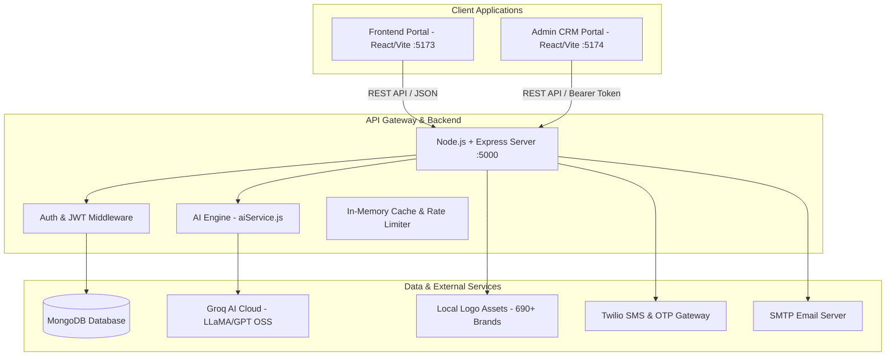

# 🌐 UniCoach — Platform Architecture & Master System Blueprint

---

## 📌 1. Executive Overview
**UniCoach** is a next-generation, AI-powered Study Abroad Ecosystem that combines:
1. **Student Web Portal:** Admission eligibility calculator, scholarship discovery, and a full suite of AI preparation tools (IELTS examiner, SOP generator, Visa interview evaluator, 6-month roadmap builder).
2. **Admin & Counselor CRM:** Lead management, automated AI lead scoring (Hot/Warm/Cold), 1-click WhatsApp/Email smart outreach, Kanban pipeline, and SEO content generator.
3. **High-Speed Backend & Database:** 800+ Global Universities, master scholarship datasets, and sub-second Groq AI inference.

---

## 🏛️ 2. Platform Architecture Map

---

## 💻 3. Technology Stack & Directory Structure

| Layer | Technologies Used | Directory Path |
| :--- | :--- | :--- |
| **Frontend Portal** | React 18, Vite, TailwindCSS, Lucide Icons, Canvas Confetti | `c:\unicoach\frontend\` |
| **Admin CRM** | React 18, Vite, Ant Design 5, Drag & Drop Pipeline | `c:\unicoach\admin\` |
| **Backend API** | Node.js, Express.js, Mongoose ODM, JWT, Nodemailer | `c:\unicoach\backend\` |
| **Database** | MongoDB Atlas / Local MongoDB with connection pooling | `backend/models/` |
| **AI LLM Engine** | Groq Cloud API (`openai/gpt-oss-20b`, `openai/gpt-oss-120b`) | `backend/utils/aiService.js` |

---

## 📁 4. Representative Documentation Index

Har feature ki deep-dive technical aur client explanation files neeche indexed hain:

1. [`01_STUDY_ABROAD_ADMISSION_AND_SCHOLARSHIP_CALCULATOR.md`](./01_STUDY_ABROAD_ADMISSION_AND_SCHOLARSHIP_CALCULATOR.md)
2. [`02_AI_UNIVERSITY_AND_SCHOLARSHIP_EXPLAINER.md`](./02_AI_UNIVERSITY_AND_SCHOLARSHIP_EXPLAINER.md)
3. [`03_AI_IELTS_ACADEMIC_WRITING_EXAMINER.md`](./03_AI_IELTS_ACADEMIC_WRITING_EXAMINER.md)
4. [`04_AI_STATEMENT_OF_PURPOSE_SOP_GENERATOR.md`](./04_AI_STATEMENT_OF_PURPOSE_SOP_GENERATOR.md)
5. [`05_AI_VISA_INTERVIEW_SIMULATOR.md`](./05_AI_VISA_INTERVIEW_SIMULATOR.md)
6. [`06_AI_STRATEGIC_STUDY_ROADMAP_BUILDER.md`](./06_AI_STRATEGIC_STUDY_ROADMAP_BUILDER.md)
7. [`07_UNIBOT_24X7_AI_COUNSELOR_CHAT.md`](./07_UNIBOT_24X7_AI_COUNSELOR_CHAT.md)
8. [`08_ADMIN_CRM_AI_LEAD_ASSISTANT_AND_SCORING.md`](./08_ADMIN_CRM_AI_LEAD_ASSISTANT_AND_SCORING.md)
9. [`09_ADMIN_CONTENT_HUB_AND_AI_SEO_BLOG_GENERATOR.md`](./09_ADMIN_CONTENT_HUB_AND_AI_SEO_BLOG_GENERATOR.md)
10. [`10_ADMIN_CRM_PIPELINES_COMMUNICATION_AND_TRACKING.md`](./10_ADMIN_CRM_PIPELINES_COMMUNICATION_AND_TRACKING.md)
11. [`11_PRODUCTION_DEPLOYMENT_AND_API_KEYS_CHECKLIST.md`](./11_PRODUCTION_DEPLOYMENT_AND_API_KEYS_CHECKLIST.md)
12. [`12_ENTERPRISE_SECURITY_HARDENING_AND_CRASH_DEFENSE.md`](./12_ENTERPRISE_SECURITY_HARDENING_AND_CRASH_DEFENSE.md)
