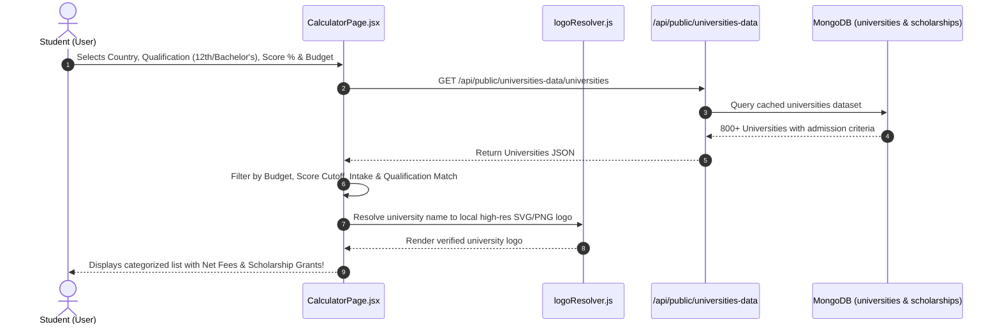

# 🎓 Feature 1: Study Abroad Admission & Scholarship Eligibility Calculator

---

## 📌 1. Purpose & Business Value
Yeh UniCoach ka primary flagship lead generation engine hai. 
Student ko sirf apna:
1. **Target Destination** (USA, UK, Canada, Germany, Australia, Ireland, New Zealand)
2. **Current Qualification** (12th Board CBSE/ICSE, Bachelor's Degree B.Tech/BBA/B.Sc, ya Master's)
3. **Academic Score % / GPA**
4. **Annual Budget Affordability** (₹ Lakhs per year slider & strict budget filter)
5. **English Test Status** (IELTS, TOEFL, Duolingo, ya Not Yet Given)

enter karte hi system **800+ Top Global Universities** aur **Master Scholarships** mein se instantly:
- **Admission Match Odds** (High Chance 🟢, Moderate 🟡, Dream 🔴)
- **Calculated Scholarship Amount** (Exact ₹ Lakhs & $ USD amount)
- **Net Post-Scholarship Tuition Fee**
- **Accurate University Logos** (from 690+ verified local logo assets)

calculate karke ek modern 2-column uncluttered interface mein display karta hai.

---

## 🔄 2. How It Works (Step-by-Step Data Flow)

---

## 📂 3. Connected Files & Code Architecture

| Component | Path | Responsibility |
| :--- | :--- | :--- |
| **Main Page UI** | `frontend/src/pages/CalculatorPage.jsx` | Input forms, dynamic qualification selector, budget slider, results rendering |
| **Logo Resolver** | `frontend/src/utils/logoResolver.js` | Fuzzy matching of university names to 690+ local SVG/PNG files |
| **Logo Component** | `frontend/src/components/UniversityLogo.jsx` | Clean fallback avatar if logo is missing |
| **Backend API Route** | `backend/routes/publicUniversities.js` | Fast cached endpoint returning all verified global universities |
| **Master Dataset** | `unicoach_scholarships_only/master_all_scholarships.json` | 800+ universities & scholarship rules |

---

## 💼 4. Client Pitch & Demo Talking Points
1. **"Zero Manual Research":** Student ko 10 alag websites nahi dekhni padti. 1 minute mein 800+ universities ka personalized evaluation mil jata hai.
2. **"Dynamic Qualification Intelligence":** Agar student 12th select karta hai toh CBSE/ICSE percentages aati hain; Bachelor's select karta hai toh B.Tech/BBA/CGPA aati hain.
3. **"True Affordability Calculation":** Student apna ₹ Lakh budget set karta hai, aur calculator sirf wahi universities dikhata hai jo unke budget aur scholarship ke baad fit hoti hain.
