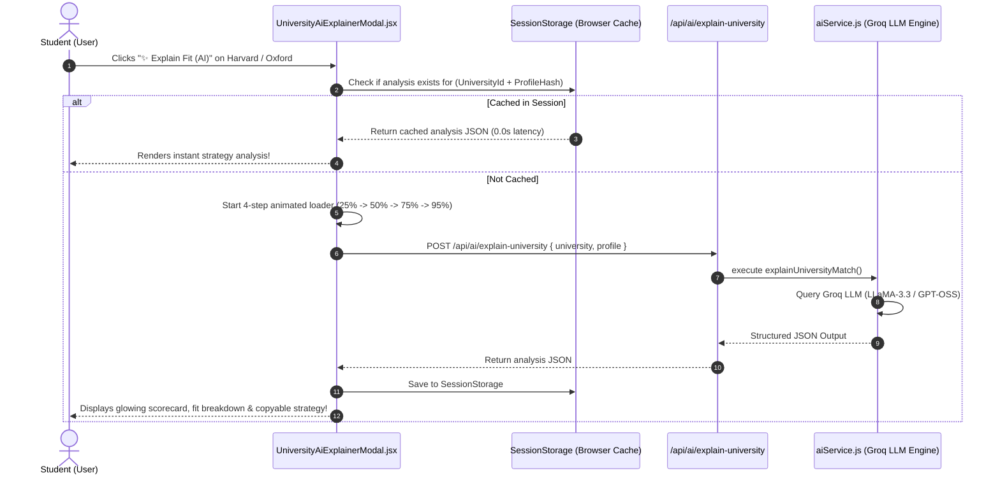

# 💡 Feature 2: AI University Fit & Scholarship Explainer Engine

---

## 📌 1. Purpose & Business Value
Jab student calculator mein kisi university ya scholarship par click karta hai, toh **"Explain Fit (AI)"** ya **"View Strategy (AI)"** button se ek deep-dive AI consultation open hota hai.

Yeh AI modal student ko detailed guidance deta hai:
1. **Admission Odds & Probability:** Kyu yeh university unke profile ke liye Match/Reach/Safe hai.
2. **Winning Strategy:** Profile mein kya improve karein taaki 100% scholarship ya admit mile.
3. **Insider Counselor Tips:** Course selection, professor networking, aur visa acceptance tips.
4. **Instant 0.0s Memory Cache:** Dubara dekhne par page 0.00 second mein bina kisi API load ke instant khulta hai.

---

## 🔄 2. How It Works (Step-by-Step Data Flow)

---

## 📂 3. Connected Files & Code Architecture

| Component | Path | Responsibility |
| :--- | :--- | :--- |
| **University Explainer UI** | `frontend/src/components/UniversityAiExplainerModal.jsx` | `z-[99999]` Modal overlay, multi-step animated loader, 0.0s cache, strategy tabs |
| **Scholarship Explainer UI** | `frontend/src/components/ScholarshipAiExplainerModal.jsx` | Scholarship donor criteria, essay winning tips, deadline alerts |
| **Backend AI Controller** | `backend/routes/ai.js` | Endpoint `/api/ai/explain-university` and `/api/ai/explain-scholarship` |
| **AI Prompt Engine** | `backend/utils/aiService.js` | `explainUniversityMatch()` and `explainScholarshipMatch()` |
| **Active AI Models** | Groq Cloud | `openai/gpt-oss-20b` / `openai/gpt-oss-120b` |

---

## 💼 4. Client Pitch & Demo Talking Points
1. **"Instant AI Senior Counselor in Pocket":** Student ko counselor se appointment lene ki zaroorat nahi hai; AI instantly batata hai ki profile mein kya kami hai aur kya strength hai.
2. **"Lightning Fast & Cost Efficient":** `sessionStorage` caching ki wajah se backend API par baar-baar load nahi padta aur user ko 0-second instant loading milti hai.
3. **"High Conversion 1-Click Copy":** Student "Copy Strategy" par click karke apne counselor ko WhatsApp par forward kar sakta hai.
