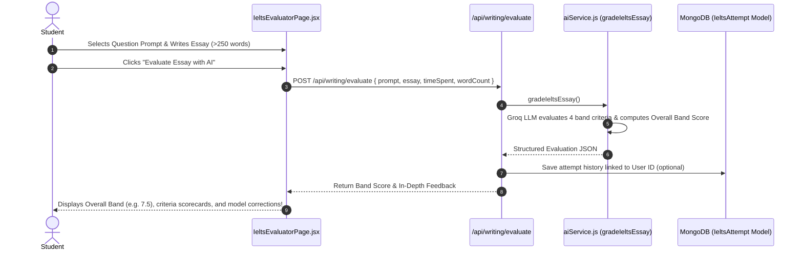

# ✍️ Feature 3: AI IELTS Academic Writing Task 2 Examiner

---

## 📌 1. Purpose & Business Value
IELTS Academic Writing Task 2 students ke liye sabse difficult aur expensive module hota hai (human evaluation costs ₹500 - ₹1500 per essay).

UniCoach ka **AI IELTS Examiner**:
- Real British Council / IDP veteran examiner prompt structure use karta hai.
- **4 Official IELTS Public Band Criteria** par 1.0 se 9.0 band score calculate karta hai:
  1. **Task Achievement & Response (TR)**
  2. **Coherence & Cohesion (CC)**
  3. **Lexical Resource / Vocabulary (LR)**
  4. **Grammatical Range & Accuracy (GRA)**
- Real-time word counter (minimum 250 words check) aur timer tracking.
- Paraphrasing suggestions aur paragraph-by-paragraph line edits deta hai.

---

## 🔄 2. How It Works (Step-by-Step Data Flow)

---

## 📂 3. Connected Files & Code Architecture

| Component | Path | Responsibility |
| :--- | :--- | :--- |
| **Frontend UI Page** | `frontend/src/pages/IeltsEvaluatorPage.jsx` | Rich writing editor, word counter, timer, band breakdown cards |
| **Backend API Route** | `backend/routes/writing.js` | Endpoint `/api/writing/evaluate` & `/api/writing/history` |
| **AI Grading Engine** | `backend/utils/aiService.js` | `gradeIeltsEssay()` prompt following official British Council band descriptors |
| **Mongoose Model** | `backend/models/IeltsAttempt.js` | Persists previous essay attempts, scores, and progress |

---

## 💼 4. Client Pitch & Demo Talking Points
1. **"Official British Council Standard":** Generic AI text nahi deta; exact 4 criteria scores (TR, CC, LR, GRA) aur official band calculation (0.25 rounding rule) follow karta hai.
2. **"Free Lead Magnet for EdTechs":** Students bar-bar essay check karne aate hain, jisse daily platform active users (DAU) aur leads increase hoti hain.
