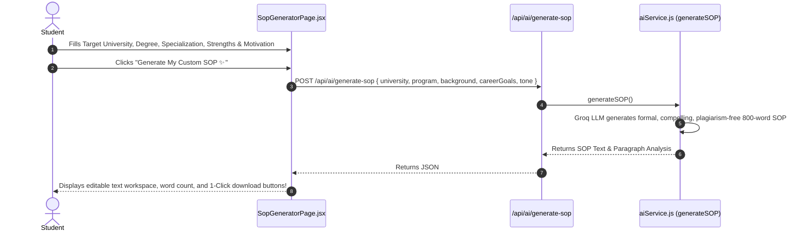

# 📄 Feature 4: AI Statement of Purpose (SOP) Generator

---

## 📌 1. Purpose & Business Value
Statement of Purpose (SOP) study abroad application ka sabse critical document hota hai. Most students weak format ya plagiarized content ki wajah se reject ho jate hain.

UniCoach **AI SOP Generator**:
- Target University, Program (e.g., M.S. in Computer Science at TU Munich), Career Goals, Academic Projects, aur Personal Motivation ko input leta hai.
- 5-Paragraph structured, university-specific, visa-compliant SOP generate karta hai:
  1. **Hook & Academic Motivation**
  2. **Undergraduate Background & Research Experience**
  3. **Why this Specific Program & Target University**
  4. **Short-term & Long-term Career Vision**
  5. **Conclusion & Value Addition to Campus**
- 1-Click download as `.txt` / `.doc` and copy to clipboard.

---

## 🔄 2. How It Works (Step-by-Step Data Flow)

---

## 📂 3. Connected Files & Code Architecture

| Component | Path | Responsibility |
| :--- | :--- | :--- |
| **Frontend UI Page** | `frontend/src/pages/SopGeneratorPage.jsx` | Multi-step form, live word counter, download buttons, formatting tools |
| **Backend API Route** | `backend/routes/ai.js` | Endpoint `POST /api/ai/generate-sop` |
| **AI Prompt Engine** | `backend/utils/aiService.js` | `generateSOP()` with university-aligned rhetoric and Ivy League admission committee standards |

---

## 💼 4. Client Pitch & Demo Talking Points
1. **"10x Faster than Human Drafting":** Jo SOP draft karne mein 3 se 5 din lagte the, AI usse 10 seconds mein ready kar deta hai.
2. **"University-Tailored":** Generic SOP nahi banta; university ke professors, research labs aur curriculum ko mention karta hai.
