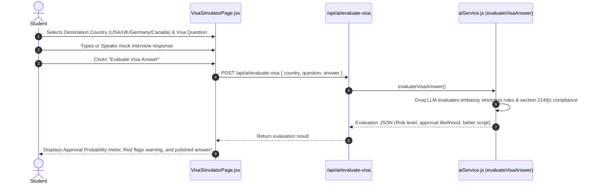

# 🛂 Feature 5: AI Visa Interview Simulator & Answer Evaluator

---

## 📌 1. Purpose & Business Value
Student visa (F-1 for USA, Tier 4 for UK, Study Permit for Canada, German Student Visa) interview mein 214(b) immigrant intent ya financial proof na hone ki wajah se visa reject ho jata hai.

UniCoach **AI Visa Simulator**:
- Real embassy interview questions simulate karta hai (*"Why this university?", "Who is funding your education?", "Do you plan to return to India?"*).
- Student ke answer ko **Consular Visa Officer perspective** se evaluate karta hai:
  1. **Visa Approval Probability:** (High / Medium / Red Flag Alert 🚩)
  2. **Immigrant Intent Risk Check:** (Checks for home-country ties compliance)
  3. **Financial Clarity:** (Evaluation of funds, loans, and sponsor explanation)
  4. **Optimized Answer Script:** Student ke answer ko diplomatic, confident aur compliant banakar dikhata hai.

---

## 🔄 2. How It Works (Step-by-Step Data Flow)

---

## 📂 3. Connected Files & Code Architecture

| Component | Path | Responsibility |
| :--- | :--- | :--- |
| **Frontend UI Page** | `frontend/src/pages/VisaSimulatorPage.jsx` | Embassy question picker, audio/text answer box, approval meter |
| **Backend API Route** | `backend/routes/ai.js` | Endpoint `POST /api/ai/evaluate-visa` |
| **AI Prompt Engine** | `backend/utils/aiService.js` | `evaluateVisaAnswer()` trained on visa denial patterns and immigration rules |

---

## 💼 4. Client Pitch & Demo Talking Points
1. **"Zero Visa Rejection Shock":** Student ko embassy jaane se pehle hi pata chal jata hai ki unke answer mein kaunse red flags hain.
2. **"Covers USA, UK, Canada & Germany":** Har country ke visa rules (e.g. Blocked account for Germany, F-1 home ties for USA) specific hote hain.
