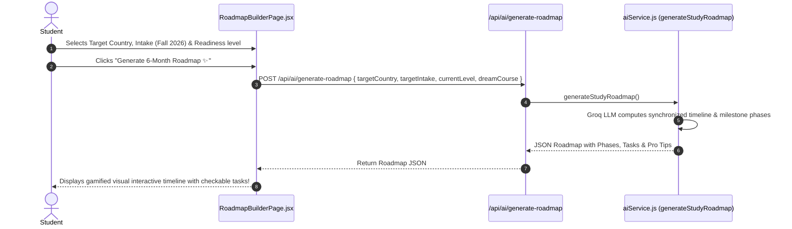

# 🗺️ Feature 6: AI Strategic Study Roadmap Builder

---

## 📌 1. Purpose & Business Value
Study abroad planning mein 6 se 12 mahine lagte hain (Standardized tests ➔ University Shortlisting ➔ Document Prep ➔ Application ➔ Financials ➔ Visa). Most students deadlines miss kar dete hain.

UniCoach **AI Strategic Roadmap Builder**:
- Student ke Target Country, Target Intake (e.g. Fall 2026), aur Current Stage ke hisaab se **Month-by-Month Action Plan** banata hai.
- Includes:
  - 📅 **Month-by-Month Critical Milestones** (e.g. *Month 1: IELTS & Shortlisting, Month 3: LOR & SOP drafting, Month 5: Priority Application Submissions, Month 6: I-20 / CAS Request & Visa slot booking*).
  - ⚠️ **High-Risk Pitfalls & Deadlines** (Scholarship priority deadlines vs standard deadlines).
  - 📋 **Interactive Checklist:** Student tasks ko tick karke progress track kar sakta hai.

---

## 🔄 2. How It Works (Step-by-Step Data Flow)

---

## 📂 3. Connected Files & Code Architecture

| Component | Path | Responsibility |
| :--- | :--- | :--- |
| **Frontend UI Page** | `frontend/src/pages/RoadmapBuilderPage.jsx` | Gamified timeline UI, phase step indicator, printable roadmap |
| **Backend API Route** | `backend/routes/ai.js` | Endpoint `POST /api/ai/generate-roadmap` |
| **AI Prompt Engine** | `backend/utils/aiService.js` | `generateStudyRoadmap()` with intake calendar synchronization logic |

---

## 💼 4. Client Pitch & Demo Talking Points
1. **"Never Miss an Intake Deadline":** Student ko pata hota hai ki kis month mein kaunsa document ready karna hai.
2. **"Reduces Counselor Follow-up Friction":** Student khud aware hota hai ki process kahan tak pahuncha hai.
