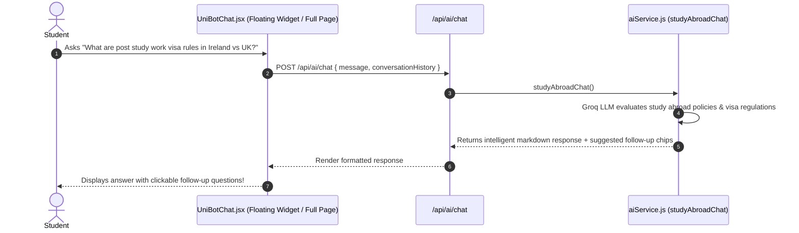

# 💬 Feature 7: UniBot — 24/7 AI Study Abroad Counselor Chat

---

## 📌 1. Purpose & Business Value
Website visitors aur registered students ke queries ko 24/7 bina kisi delay ke solve karne ke liye **UniBot** banaya gaya hai.

UniBot:
- Multi-turn conversational memory maintain karta hai.
- Country comparisons (*"USA vs Germany for MS in CS under ₹25 Lakhs"*), visa queries, post-study work visa (PSW) rules, aur scholarship advice deta hai.
- Conversations ke dauran student se unka name/phone puchkar automatically **Lead capture** karta hai.

---

## 🔄 2. How It Works (Step-by-Step Data Flow)

---

## 📂 3. Connected Files & Code Architecture

| Component | Path | Responsibility |
| :--- | :--- | :--- |
| **Frontend Chat Widget** | `frontend/src/components/UniBotFloatingChat.jsx` / `ChatbotModal.jsx` | Floating launcher, message bubble layout, quick action pills |
| **Backend API Route** | `backend/routes/ai.js` | Endpoint `POST /api/ai/chat` |
| **AI Prompt Engine** | `backend/utils/aiService.js` | `studyAbroadChat()` with expert counselor persona and lead capture cues |

---

## 💼 4. Client Pitch & Demo Talking Points
1. **"Instant 24/7 Support":** Night ya weekend par bhi leads drop nahi hoti; bot student ko engage karke call book kar leta hai.
2. **"Trained on Latest 2026 Regulations":** UK graduate route, Canadian work permits, aur German opportunity card (Chancenkarte) sab updated hain.
