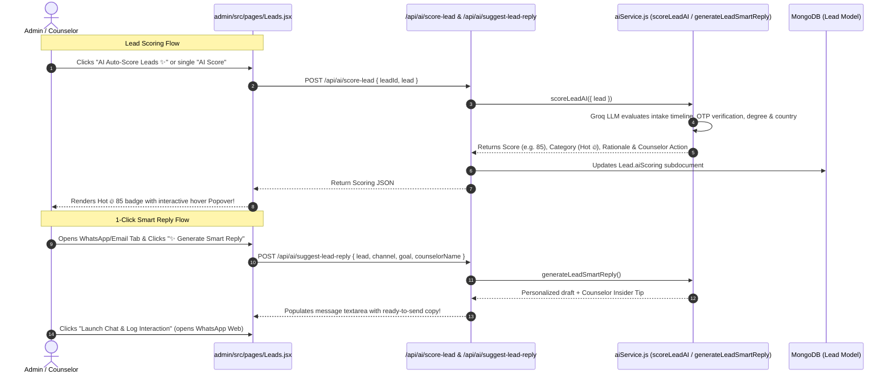

# 🔥 Feature 8: Admin CRM AI Lead Scoring & 1-Click Smart Reply Assistant

---

## 📌 1. Purpose & Business Value
Education consultancy mein counselors ka 70% time fake ya cold leads par waste hota hai. 

UniCoach **Admin AI Lead Assistant**:
1. **Automated Lead Scoring (0 - 100):**
   - **🔥 HOT (80-100):** High intent (e.g. Sep 2026 intake + Verified Mobile + USA/UK + Bachelor's).
   - **⚡ WARM (50-79):** Moderate timeline or pending test scores.
   - **❄️ COLD (0-49):** Unverified phone or distant intent.
2. **AI Lead Intelligence Card:** Lead modal ke andar instant conversion probability, score progress bar, rationale aur counselor next step advice dikhata hai.
3. **1-Click AI Smart Reply Generator (WhatsApp Studio & Email Studio):**
   - Counselor ko sirf goal select karna hai (e.g., *📅 Book 1-on-1 Call, 📄 Request Transcripts, ⏰ Intake Deadline, 🎓 Pitch Top Universities*).
   - Button click karte hi AI student ke naam, dream country aur profile ke hisaab se **personalized high-converting outreach message** draft textarea mein automatically likh deta hai!

---

## 🔄 2. How It Works (Step-by-Step Data Flow)

---

## 📂 3. Connected Files & Code Architecture

| Component | Path | Responsibility |
| :--- | :--- | :--- |
| **Admin Leads CRM UI** | `admin/src/pages/Leads.jsx` | AI Score column with Popover, AI Lead Intelligence card, WhatsApp & Email smart reply toolbar |
| **Backend AI Gateway** | `backend/routes/ai.js` | Endpoints `POST /api/ai/score-lead`, `/suggest-lead-reply`, `/batch-score-leads` |
| **AI Scoring Engine** | `backend/utils/aiService.js` | `scoreLeadAI()` and `generateLeadSmartReply()` with intelligent heuristic fallbacks |
| **Lead Database Schema** | `backend/models/Lead.js` | `aiScoring` schema fields (`score`, `category`, `rationale`, `suggestedAction`, `conversionProbability`, `scoredAt`) |

---

## 💼 4. Client Pitch & Demo Talking Points
1. **"3x Higher Counselor Productivity":** Counselor ko type nahi karna padta; 1-click mein AI perfect human-like message likh deta hai.
2. **"Data-Driven Conversion":** Hot leads ko sabse pehle call kiya jata hai, jisse inquiry-to-admission conversion rate 40% tak improve hota hai.
3. **"Safe & Reliable":** Agar internet ya API delay ho, tab bhi background heuristic fallback system hamesha score calculate karke return karta hai.
