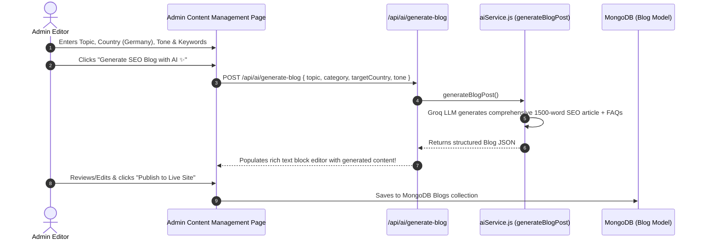

# 📰 Feature 9: Admin Content Hub & AI SEO Blog Generator

---

## 📌 1. Purpose & Business Value
Study abroad website ke organic Google rankings (SEO) ke liye regular country guides, visa updates aur comparison blogs chahiye hote hain.

UniCoach **AI Content & SEO Generator**:
- Admin ko sirf **Topic** (e.g. *"Complete Guide to Post-Study Work Visa in Germany 2026"*), **Category**, aur **Target Country** enter karna hai.
- AI automatically generate karta hai:
  1. **SEO Meta Title & Meta Description** (Under 160 characters, keyword optimized)
  2. **URL Slug** (e.g. `germany-psw-visa-guide-2026`)
  3. **Structured Article Sections** with `h2`, `h3`, key takeaways, and bulleted steps.
  4. **Interactive BlockBuilder JSON** compatible with UniCoach frontend rendering.
  5. **Google FAQ Schema** (Question & Answer accordion).

---

## 🔄 2. How It Works (Step-by-Step Data Flow)

---

## 📂 3. Connected Files & Code Architecture

| Component | Path | Responsibility |
| :--- | :--- | :--- |
| **Admin Blog UI** | `admin/src/pages/Blogs.jsx` / `ContentManagement.jsx` | Blog editor, AI generator modal, status (Draft/Published) |
| **Backend API Route** | `backend/routes/ai.js` | Endpoint `POST /api/ai/generate-blog` |
| **AI Content Engine** | `backend/utils/aiService.js` | `generateBlogPost()` with schema markup, SEO heading hierarchy, and FAQ blocks |
| **Blog Database Model** | `backend/models/Blog.js` | Stores blog slugs, content blocks, featured images, and tags |

---

## 💼 4. Client Pitch & Demo Talking Points
1. **"Hands-Free Content Marketing":** Content writers par dependency khatam; 30 seconds mein high-ranking SEO blogs live ho jate hain.
2. **"Built for Google Rank #1":** Proper H2/H3 tags, key takeaways boxes, and structured FAQ schema automatic include hota hai.
