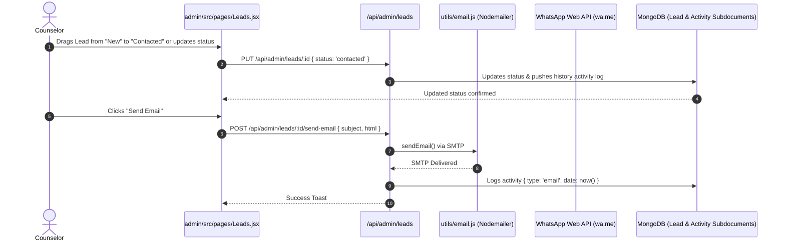

# 🎚️ Feature 10: Admin CRM Pipelines, Outreach & Lead Tracking

---

## 📌 1. Purpose & Business Value
UniCoach CRM pura complete study abroad lead lifecycle manage karta hai:
1. **Multi-Stage Kanban Pipeline:** (New ➔ Contacted ➔ Qualified ➔ Converted ➔ Closed) with Drag & Drop functionality.
2. **Counselor Assignment & Role Management:** Leads ko specific counselors (Pooja Sharma, Rohan Verma, Amit Patel, Sara Khan) ko assign karna.
3. **Follow-Up Date & Due Reminder Alerts:** Automatic highlights when follow-up is overdue (⏰ Red tag).
4. **Omni-Channel Outreach:**
   - **WhatsApp Web Integration:** 1-Click Click-to-Chat pre-filled messages.
   - **SMTP Email Studio:** Direct HTML email delivery with welcome / consultation templates.
   - **Activity Timeline:** Call logs, notes, and auto-generated communication timestamps.
5. **CSV Bulk Import & Export:** Easy migration from Google Sheets / Facebook Ads.

---

## 🔄 2. How It Works (Step-by-Step Data Flow)

---

## 📂 3. Connected Files & Code Architecture

| Component | Path | Responsibility |
| :--- | :--- | :--- |
| **Admin Leads Management UI** | `admin/src/pages/Leads.jsx` | Table view, Kanban board, filter dropdowns, CSV upload/export, activity logging |
| **Admin Leads API Routes** | `backend/routes/adminLeads.js` | Full CRUD, activity logging, status updates, email dispatch |
| **Email Dispatch Engine** | `backend/utils/email.js` | Nodemailer SMTP integration with fallback simulation |
| **Pipeline Schema** | `backend/models/Pipeline.js` / `Lead.js` | Custom pipeline stages, form submissions, counselor tags |

---

## 💼 4. Client Pitch & Demo Talking Points
1. **"All-in-One CRM, No Expensive Third-Party Subscriptions":** HubSpot ya Salesforce lene ki zaroorat nahi; pura study abroad lead cycle built-in hai.
2. **"Audit Trail for Every Lead":** Har call note, email aur WhatsApp status time ke sath log hota hai, jisse manager counselor accountability track kar sakta hai.
